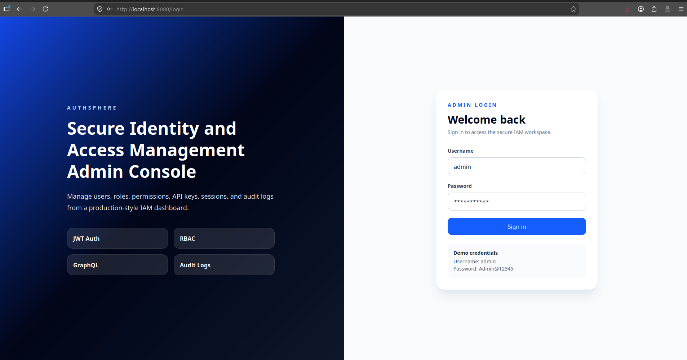
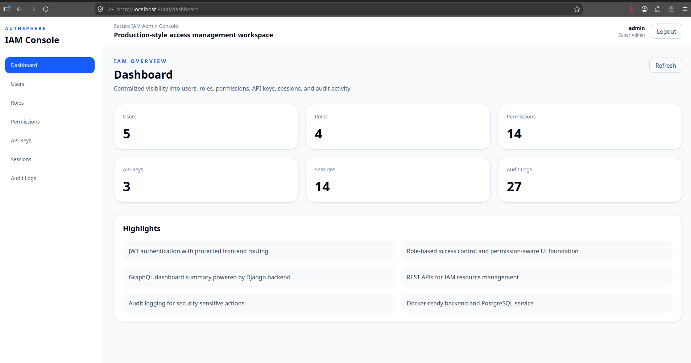
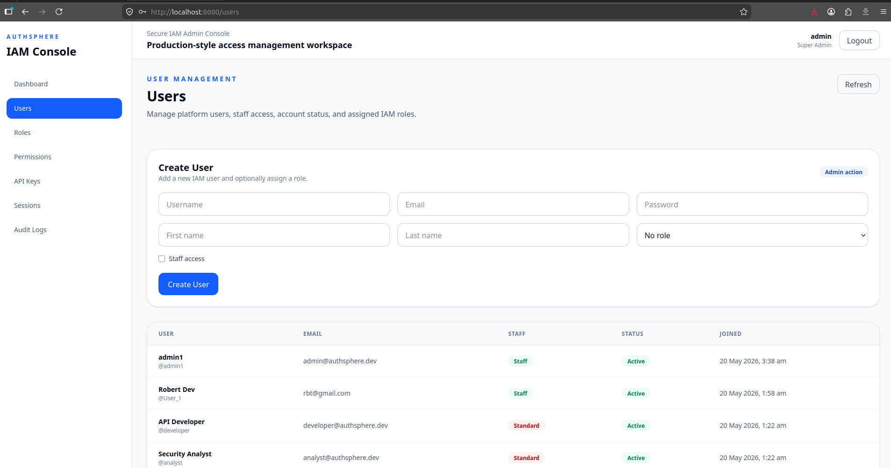
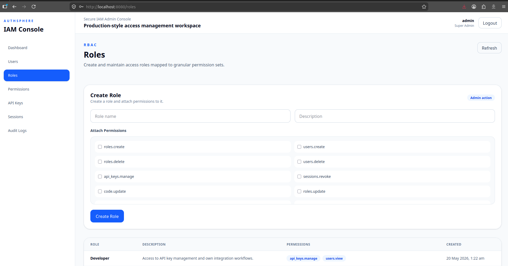
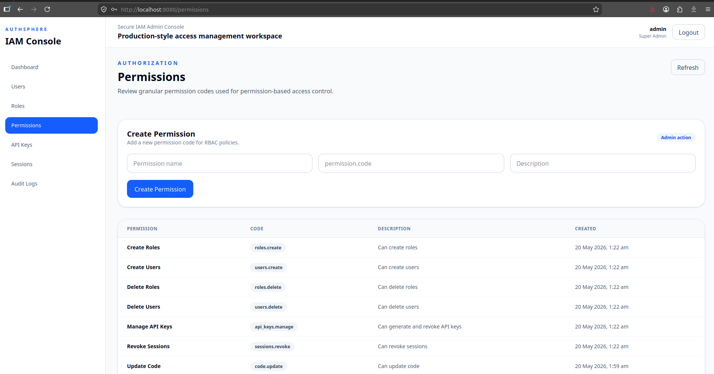
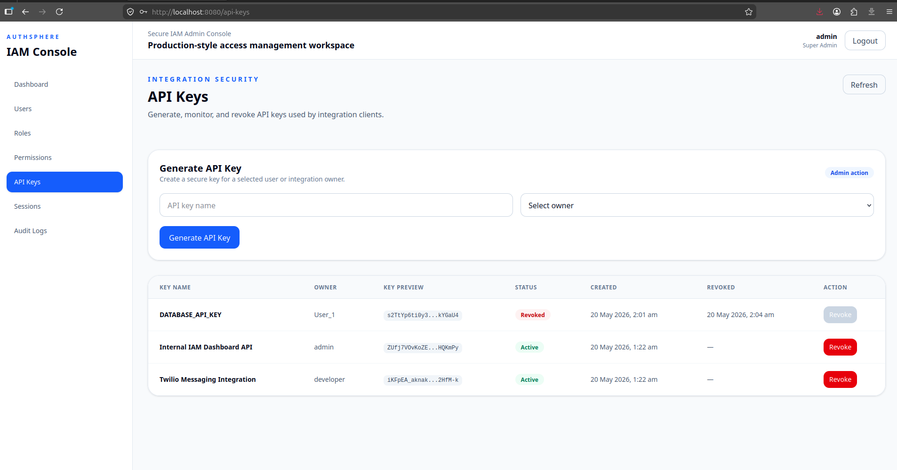
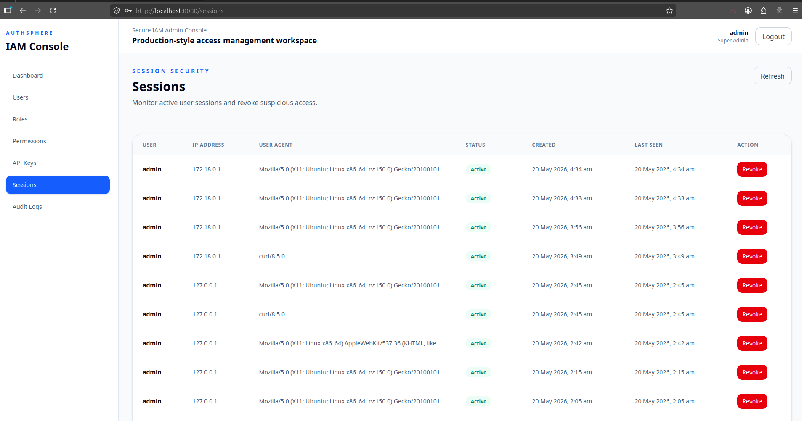
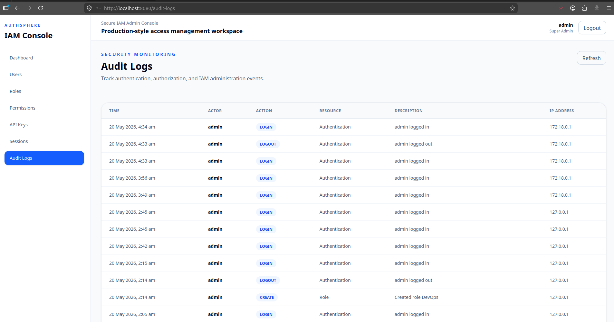
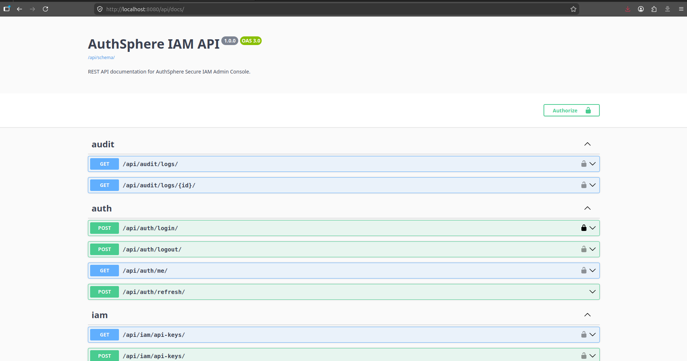

# AuthSphere — Secure IAM Admin Console

AuthSphere is a production-style Identity and Access Management admin console built to demonstrate secure full-stack application development, role-based access control, API integration, auditability, containerization, and CI-ready engineering practices.

The project simulates the kind of internal IAM platform used by engineering and security teams to manage users, roles, permissions, API keys, sessions, and audit logs from a centralized dashboard.

---

## Product Screenshots

### Login Page



### IAM Dashboard



### User Management



### Role Management



### Permission Management



### API Key Management



### Session Management



### Audit Logs



### Swagger API Documentation



---

## Why This Project Exists

Modern SaaS platforms need secure access management systems that are reliable, observable, and easy for administrators to operate.

AuthSphere was built to demonstrate the ability to work on IAM-focused product engineering problems such as:

- Secure authentication and token-based access
- Role-Based Access Control
- Permission-aware frontend rendering
- API key lifecycle management
- Session visibility and revocation
- Audit logging for sensitive actions
- GraphQL-powered dashboard analytics
- REST API workflows
- Dockerized production-style deployment
- CI-ready test automation

This project is designed as a recruiter-facing, real-world engineering portfolio project rather than a simple CRUD application.

---

## What AuthSphere Can Do

### Authentication and Access Control

AuthSphere supports secure admin login using JWT authentication. After login, users are routed into a protected dashboard. Unauthorized users cannot access internal IAM pages.

Implemented capabilities:

- Login
- Logout
- JWT access token handling
- Refresh token endpoint
- Protected frontend routes
- Authenticated REST API access
- Current user profile API

---

### User Management

Admins can view and create users from the dashboard.

The Users module includes:

- User listing
- Username and email visibility
- Staff status indicator
- Active or disabled status indicator
- Joined date
- Create user form
- Optional role assignment during user creation

---

### Role-Based Access Control

AuthSphere includes a custom RBAC model where users can be assigned roles, and roles can be attached to granular permissions.

The Roles module includes:

- Role listing
- Role descriptions
- Permission mapping
- Create role form
- Multi-permission selection while creating roles

Seeded roles include:

- IAM Admin
- Security Analyst
- Developer

---

### Permission Management

Permissions are managed as granular access codes that can be attached to roles.

The Permissions module includes:

- Permission listing
- Permission code visibility
- Permission descriptions
- Create permission form

Example permission codes:

- `users.view`
- `users.create`
- `roles.create`
- `api_keys.manage`
- `sessions.revoke`
- `audit_logs.view`

---

### Permission-Based UI Rendering

AuthSphere includes frontend permission-aware rendering through a reusable `PermissionGuard` component.

This means sensitive UI actions can be conditionally displayed based on the logged-in user's role and permissions.

Protected UI examples:

- Create user form
- Create permission form
- Generate API key form
- API key revoke button
- Session revoke button

This shows how frontend authorization logic can support backend access-control policies.

---

### API Key Management

Admins can generate and revoke API keys for users or integration owners.

The API Keys module includes:

- API key listing
- API key owner visibility
- Secure key preview
- Active/revoked status
- API key creation
- API key revocation
- Revoked timestamp tracking

This demonstrates API credential lifecycle management, a common IAM and platform engineering requirement.

---

### Session Management

AuthSphere records login sessions and allows admins to revoke sessions.

The Sessions module includes:

- Session listing
- Username
- IP address
- User agent
- Active/revoked status
- Session creation time
- Last seen timestamp
- Session revoke action

This gives administrators visibility into active access and suspicious sessions.

---

### Audit Logging

Security-sensitive actions are recorded in audit logs.

Audit events are created for actions such as:

- Login
- Logout
- User creation
- Role creation
- Permission creation
- API key generation
- API key revocation
- Session revocation

The Audit Logs module includes:

- Timestamp
- Actor
- Action type
- Resource
- Description
- IP address

This demonstrates accountability and traceability in IAM workflows.

---

### GraphQL Dashboard

The main dashboard uses GraphQL to display IAM summary metrics.

Dashboard metrics include:

- Total users
- Total roles
- Total permissions
- Total API keys
- Total sessions
- Total audit logs

This demonstrates GraphQL integration in a practical dashboard use case.

---

## Application Screens

AuthSphere includes the following major screens:

- Login page
- IAM dashboard
- Users management
- Roles management
- Permissions management
- API keys management
- Sessions monitoring
- Audit logs monitoring

Each screen is designed with a clean admin-console layout, sidebar navigation, responsive spacing, and recruiter-friendly presentation.

---

## API Overview

AuthSphere uses both REST and GraphQL.

REST APIs are used for authentication and IAM actions.

GraphQL is used for dashboard analytics.

### Authentication APIs

```txt
POST /api/auth/login/
POST /api/auth/refresh/
POST /api/auth/logout/
GET  /api/auth/me/
```

### IAM REST APIs

```txt
GET    /api/iam/users/
POST   /api/iam/users/

GET    /api/iam/roles/
POST   /api/iam/roles/

GET    /api/iam/permissions/
POST   /api/iam/permissions/

GET    /api/iam/api-keys/
POST   /api/iam/api-keys/
POST   /api/iam/api-keys/{id}/revoke/

GET    /api/iam/sessions/
POST   /api/iam/sessions/{id}/revoke/
```

### Audit APIs

```txt
GET /api/audit/logs/
```

### GraphQL Endpoint

```txt
POST /graphql/
```

Example dashboard query:

```graphql
{
  dashboardSummary {
    totalUsers
    totalRoles
    totalPermissions
    totalApiKeys
    totalSessions
    totalAuditLogs
  }
}
```

### API Documentation

Swagger documentation is available at:

```txt
/api/docs/
```

---

## Testing Coverage

AuthSphere includes automated testing across backend, frontend, and browser flows.

### Backend Testing

Backend tests are written using PyTest and Django REST Framework test utilities.

Covered backend flows:

- Successful admin login
- Invalid login rejection
- Protected current-user endpoint
- Permission creation
- Role creation with permissions
- User creation
- API key generation
- API key revocation
- Session revocation
- Authenticated audit log access
- Unauthenticated audit log restriction

Run backend tests:

```bash
cd backend
source venv/bin/activate
pytest
```

---

### Frontend Unit Testing

Frontend unit tests are written using Jest and React Testing Library.

Covered frontend components:

- StatusBadge
- DataState

Run frontend tests:

```bash
cd frontend
npm test
```

---

### End-to-End Testing

Cypress is used for browser-level testing.

Covered E2E flow:

- Open login page
- Enter admin credentials
- Submit login form
- Navigate to dashboard
- Verify IAM dashboard and sidebar are visible

Run Cypress tests:

```bash
cd frontend
npm run e2e
```

---

## Dockerized Full-Stack Setup

AuthSphere runs as a containerized full-stack application using Docker Compose.

Docker services:

- PostgreSQL database
- Django backend
- React frontend
- Nginx reverse proxy

Production-style backend runtime:

- Gunicorn
- PostgreSQL
- Nginx reverse proxy
- Static file collection
- Automatic migrations on container startup

Start the full Docker stack:

```bash
docker compose up --build
```

Open the application:

```txt
http://localhost:8080/
```

---

## Local Development Setup

### Backend

```bash
cd backend
python3 -m venv venv
source venv/bin/activate
pip install -r requirements.txt
python manage.py migrate
python manage.py seed_iam
python manage.py runserver
```

Backend runs at:

```txt
http://127.0.0.1:8000/
```

### Frontend

```bash
cd frontend
npm install
npm run dev
```

Frontend runs at:

```txt
http://localhost:5173/
```

---

## Demo Credentials

After running the seed command, use:

```txt
Username: admin
Password: Admin@12345
```

Seed command:

```bash
python manage.py seed_iam
```

Seed data includes:

- IAM Admin role
- Security Analyst role
- Developer role
- Demo permissions
- Demo users
- Demo API keys
- Initial audit log

---

## CI/CD Readiness

AuthSphere includes a GitHub Actions workflow for CI validation.

The workflow checks:

- Backend dependency installation
- PostgreSQL service startup
- Django migrations
- Backend PyTest execution
- Frontend dependency installation
- Frontend Jest tests
- Frontend production build
- Docker build validation

Workflow file:

```txt
.github/workflows/ci.yml
```

This ensures the project is not only working locally but also ready for collaborative development and deployment pipelines.

---

## Engineering Decisions

### REST and GraphQL Together

REST is used for workflow-based actions such as login, logout, API key generation, and revocation.

GraphQL is used for dashboard-level aggregated data.

This mirrors a practical architecture where REST handles commands and GraphQL handles flexible dashboard queries.

### Custom IAM Models

AuthSphere uses custom IAM models for roles, permissions, API keys, user sessions, and audit logs instead of relying only on Django's default permission system.

This makes the project easier to demonstrate as a domain-specific IAM system.

### Auditability First

Sensitive events are logged to create an audit trail.

This is important for security-focused platforms where administrators need visibility into access changes and user activity.

### Dockerized Deployment Path

The application is containerized to make it easier to run consistently across local, CI, and cloud environments.

The Docker setup uses a structure close to a real deployment:

- Frontend served by Nginx
- Backend served by Gunicorn
- Reverse proxy routing through Nginx
- PostgreSQL as a separate service

---

## Current Status

Completed:

- Login and logout
- JWT authentication
- Protected routes
- RBAC data model
- Permission-based UI rendering
- User management
- Role management
- Permission management
- API key generation
- API key revocation
- Session management
- Audit logs
- GraphQL dashboard
- Swagger API documentation
- Backend tests
- Frontend tests
- Cypress E2E test
- Docker Compose setup
- Nginx reverse proxy
- Gunicorn backend runtime
- GitHub Actions CI workflow

Partially completed:

- Refresh token endpoint is available, but automatic frontend retry logic can be improved
- GraphQL is currently used for dashboard metrics, while IAM resource management is handled through REST

Planned improvements:

- Add password reset flow
- Add full GraphQL queries for users, roles, permissions, sessions, API keys, and audit logs
- Add Postman collection
- Add AWS EC2 deployment
- Add pagination and filtering improvements
- Add edit and delete actions for users, roles, and permissions
- Add stronger frontend form validation across all create forms
- Add dark mode
- Add production monitoring and structured logging

---

## Recruiter Summary

AuthSphere demonstrates the ability to build a secure, full-stack admin platform using modern frontend, backend, testing, and deployment practices.

It is not a basic CRUD app. It models real IAM workflows such as authentication, authorization, RBAC, API key lifecycle management, session control, and audit logging.

The project shows hands-on experience with:

- Building secure user-facing admin interfaces
- Designing REST and GraphQL APIs
- Managing authentication and authorization flows
- Implementing permission-aware frontend behavior
- Writing backend and frontend tests
- Debugging full-stack integration issues
- Containerizing applications with Docker
- Preparing CI workflows for production-style engineering

AuthSphere was built to reflect the type of work expected in IAM, platform engineering, and secure product engineering teams.

---

## Tech Used

### Frontend

```txt
React
TypeScript
Vite
Apollo Client
React Router
React Hook Form
Zod
Tailwind CSS
Axios
Jest
React Testing Library
Cypress
```

### Backend

```txt
Django
Django REST Framework
Graphene-Django
PostgreSQL
Django Simple JWT
drf-spectacular
PyTest
Gunicorn
```

### DevOps

```txt
Docker
Docker Compose
Nginx
GitHub Actions
```
